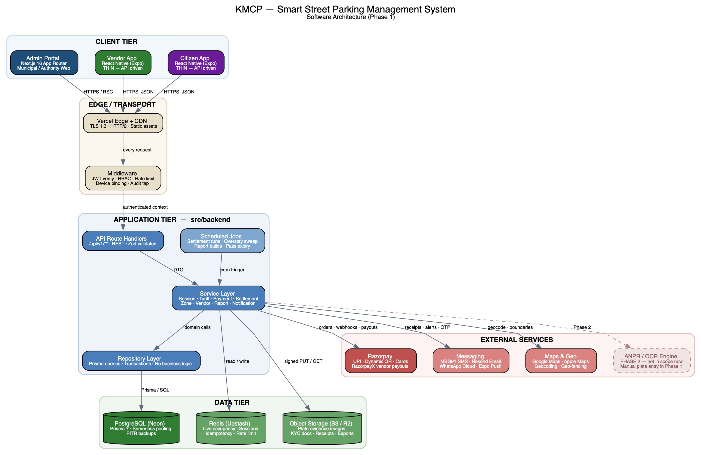
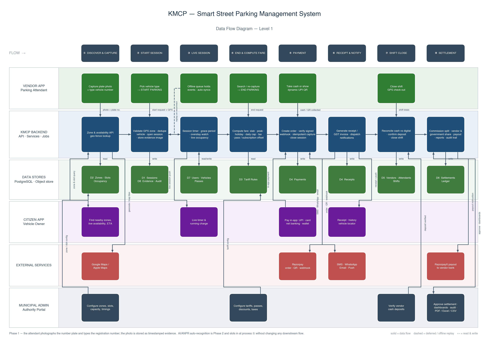

# Document Control

| Field | Detail |
|---|---|
| Product name | Smart Street Parking Management System |
| Project codename | **KMCP** |
| Document | Developer's Guide |
| Version | 1.0 |
| Audience | Engineers building and maintaining the KMCP platform |
| Companion document | *Scope of Work* (`KMCP_Scope_of_Work.docx`) |
| Phase note | AI/ANPR is **Phase 2**. In Phase 1 the attendant photographs the plate and types the registration number. |

---

# 1. Introduction

KMCP is a single full-stack **Next.js 16** application that serves the Admin Portal UI *and* the REST API consumed by two React Native (Expo) mobile applications. There is one repository, one database, one set of business rules.

## 1.1 Non-negotiable principles

| # | Principle | What it means in practice |
|---|---|---|
| 1 | **API-first** | Every capability is an API endpoint before it is a screen. The portal consumes the same `/api/v1` surface the mobile apps do. |
| 2 | **Thin mobile clients** | The mobile apps render and capture. They hold **no** business rules — no tariff tables, no tax maths, no commission logic, no geo-fence evaluation. They post events and display server responses. |
| 3 | **Layered backend** | `route → validator → service → repository → Prisma`. A route never touches Prisma; a repository never contains business logic. |
| 4 | **Money is computed server-side, once** | Fare, tax, discount, penalty, commission and government share are computed only in `tariff.service.ts` / `settlement.service.ts`. No other file may compute an amount. |
| 5 | **Every mutation is auditable** | Writes go through the audit tap: actor, action, entity, before/after, IP, device, timestamp. |
| 6 | **Idempotency everywhere it matters** | Session start/end, payment capture and offline replay all carry client-supplied idempotency keys. Retrying is always safe. |
| 7 | **Amounts are integers** | All money is stored and transported as **paise** (`Int`). Never floats. Format for display at the edge only. |
| 8 | **Times are UTC** | Stored and transported as UTC ISO-8601. Rendered in `Asia/Kolkata` at the client. |

## 1.2 Why the mobile apps are deliberately light

Attendants work on low-cost Android devices, outdoors, on unreliable street-level connectivity, several hundred times a day. Every kilobyte and every millisecond costs a real transaction. The consequences of the thin-client rule:

- **No rule ever drifts.** A tariff revision, a new vehicle category or a changed commission percentage takes effect for every device on the next request — no app-store release.
- **The app stays small.** No pricing tables, no report generators, no PDF renderers shipped to the device.
- **Offline is narrow and therefore reliable.** Only three event types are ever queued offline — *session start*, *session end*, *cash payment* — each with a client-generated UUID. Everything else requires connectivity and says so.
- **Evidence never round-trips through the API.** Images go straight from the device to object storage through a presigned URL; the API only ever handles the resulting key.

---

# 2. Software Architecture



## 2.1 Tier responsibilities

| Tier | Contains | Rules |
|---|---|---|
| **Client** | Admin Portal (Next.js), Vendor App (Expo), Citizen App (Expo) | Presentation and capture only. No business rules in the mobile clients. |
| **Edge / transport** | Vercel Edge + CDN, `middleware.ts` | TLS termination, static caching, JWT verification, RBAC pre-check, rate limiting, device-binding check, request-id assignment, audit tap. |
| **Application** | `src/backend/api` (route handlers), `src/backend/services`, `src/backend/repositories`, scheduled jobs | All business logic. Route handlers are thin: parse → validate → call service → shape response. |
| **Data** | PostgreSQL (Neon) via Prisma 7, Upstash Redis, S3/R2 object storage | Redis holds only derived/ephemeral state (occupancy counters, idempotency keys, rate-limit windows). Postgres is the source of truth. |
| **External** | Razorpay, RazorpayX, SMS/WhatsApp/email, push, maps | Reached **only** from the service layer, never from a route handler or a client. |

## 2.2 Request lifecycle

```
Device / Browser
  └─ HTTPS → Vercel Edge
       └─ middleware.ts
            ├─ verify JWT              → 401 on failure
            ├─ resolve role + scope    → 403 on failure
            ├─ device-binding check    → 403 (attendant on unregistered device)
            ├─ rate-limit bucket       → 429 on exhaustion
            └─ attach requestId + actor to headers
                 └─ src/backend/api/**/route.ts
                      ├─ Zod validator (body / query / params)
                      ├─ service (business rules, transactions, external calls)
                      │    └─ repository (Prisma only)
                      └─ ApiResponse envelope
```

## 2.3 Where things must not go

| Never | Instead |
|---|---|
| Prisma client inside a route handler or a React component | Repository, called by a service |
| `fetch()` to Razorpay/MSG91 from a route handler | `payment.service.ts` / `notification.service.ts` |
| Fare arithmetic in the mobile app or the portal | `POST /api/v1/sessions/{id}/quote` |
| Raw amounts as `Float` / `Decimal` in transport | Integer paise |
| Business rules in `middleware.ts` | Middleware does auth, rate limiting and routing concerns only |

---

# 3. Data Flow



## 3.1 Flow A — Start a parking session (the hot path)

1. Attendant opens the vendor app; the camera is already live on the *Start* screen.
2. Attendant photographs the number plate and types the registration number. The app normalises it locally to `WB02AB1234` for transport (display formatting only).
3. App requests a presigned upload URL: `POST /api/v1/media/presign` → uploads the JPEG **directly to object storage** → `POST /api/v1/media/confirm` returns a `mediaId`.
4. App calls `POST /api/v1/sessions/start` with `{ clientEventId, plateNumber, vehicleTypeId, lat, lng, capturedAt, evidenceMediaId, slotId? }`.
5. Server: resolves the zone by point-in-polygon on `lat/lng`; rejects if the attendant is outside every assigned zone geo-fence; rejects if the plate already has an `ACTIVE` session; upserts the `Vehicle`; creates the `ParkingSession` with status `ACTIVE`; increments the Redis occupancy counter; writes the audit entry.
6. Server responds with the session, the zone, and the *applicable tariff summary* for display. No tariff table is sent.
7. If the citizen owns the vehicle in their garage, a push notification fires: *"Parking started at …"*.

## 3.2 Flow B — End a parking session and collect payment

1. Attendant finds the session — `GET /api/v1/sessions/lookup?plate=…` — or re-captures the plate.
2. App calls `POST /api/v1/sessions/{id}/quote`. The server computes duration, resolves the effective tariff version, applies slab/peak/weekend/holiday/event rules, the daily cap, the grace period, any pass or subscription offset, discounts, tax and overstay penalty, and returns a **line-item breakdown** plus `payableAmount`.
3. Attendant collects:
   - **Cash** → `POST /api/v1/payments/cash` with the idempotency key.
   - **UPI QR** → `POST /api/v1/payments/order` returns a Razorpay dynamic QR; the attendant shows it; settlement is confirmed by the **webhook**, never by the client.
   - **Citizen app** → the citizen pays in-app against the same session.
4. On confirmed payment the server closes the session (`COMPLETED`), decrements occupancy, generates the receipt / GST invoice, and dispatches SMS / WhatsApp / email / push.

> **Rule:** a session is closed by the *payment confirmation*, not by the client saying so. A client-reported success on a gateway payment is advisory only.

## 3.3 Flow C — Offline capture and replay

1. With no connectivity the vendor app writes the event to its local encrypted SQLite queue with a client-generated `clientEventId` (UUID v4) and the device's monotonic timestamp.
2. Evidence images are kept on the device and uploaded first when connectivity returns.
3. On reconnect the app calls `POST /api/v1/sessions/sync` with the queued batch (max 50 events per call).
4. The server processes each event **idempotently** — `clientEventId` carries a unique constraint, so a replayed event returns the original result rather than creating a duplicate.
5. Conflicts (e.g. the same plate was started by another attendant while offline) are returned per event with a `conflict` code; the app surfaces them for supervisor resolution. Nothing is silently dropped.
6. Every sync batch is written to the sync audit log with device, attendant, event count and outcome.

## 3.4 Flow D — Shift close, settlement and payout

1. Attendant closes the shift: `POST /api/v1/shifts/{id}/end` with GPS check-out.
2. Server computes `cashExpected` (sum of cash payments in the shift) and `digitalTotal`; the attendant confirms the cash amount deposited.
3. Admin verifies the deposit: `POST /api/v1/shifts/{id}/verify`. Variances are flagged.
4. On the configured cycle (daily / weekly / monthly) the settlement job generates a `Settlement` per vendor: gross collected → commission → vendor share and government share, with a `SettlementLine` per contributing payment and balanced `LedgerEntry` rows.
5. An officer approves; `POST /api/v1/settlements/{id}/payout` instructs RazorpayX; the payout webhook updates status; a PDF statement is generated and stored.

## 3.5 Flow E — Citizen discovery

`GET /api/v1/public/zones/nearby?lat&lng&radius` returns zones with live availability (green / yellow / red), published charges, distance, ETA and operating hours. Occupancy is read from Redis counters and reconciled against Postgres on a schedule — the read path never runs a `COUNT(*)` over sessions.

---

# 4. Repository and Folder Structure

```
kmcp/
│
├── src/
│   ├── app/                          # Next.js App Router (Frontend)
│   │   ├── (auth)/
│   │   │   ├── login/
│   │   │   │   └── page.tsx
│   │   │   ├── register/
│   │   │   │   └── page.tsx
│   │   │   └── layout.tsx
│   │   ├── (dashboard)/
│   │   │   ├── dashboard/
│   │   │   │   └── page.tsx
│   │   │   ├── zones/
│   │   │   │   ├── page.tsx
│   │   │   │   └── [id]/page.tsx
│   │   │   ├── slots/
│   │   │   │   └── page.tsx
│   │   │   ├── vendors/
│   │   │   │   ├── page.tsx
│   │   │   │   └── [id]/page.tsx
│   │   │   ├── attendants/
│   │   │   │   └── page.tsx
│   │   │   ├── tariffs/
│   │   │   │   └── page.tsx
│   │   │   ├── sessions/
│   │   │   │   └── page.tsx
│   │   │   ├── payments/
│   │   │   │   └── page.tsx
│   │   │   ├── settlements/
│   │   │   │   ├── page.tsx
│   │   │   │   └── [id]/page.tsx
│   │   │   ├── revenue/
│   │   │   │   └── page.tsx
│   │   │   ├── reports/
│   │   │   │   └── page.tsx
│   │   │   ├── users/
│   │   │   │   └── page.tsx
│   │   │   ├── incidents/
│   │   │   │   └── page.tsx
│   │   │   ├── audit/
│   │   │   │   └── page.tsx
│   │   │   ├── cms/
│   │   │   │   └── page.tsx
│   │   │   ├── settings/
│   │   │   │   └── page.tsx
│   │   │   └── layout.tsx
│   │   ├── layout.tsx
│   │   ├── page.tsx
│   │   └── globals.css
│   │
│   ├── backend/                      # Backend Layer (API Logic)
│   │   ├── api/                      # API Routes (Next.js handlers)
│   │   │   ├── auth/
│   │   │   │   └── route.ts
│   │   │   ├── users/
│   │   │   │   └── route.ts
│   │   │   ├── zones/
│   │   │   │   └── route.ts
│   │   │   ├── slots/
│   │   │   │   └── route.ts
│   │   │   ├── vendors/
│   │   │   │   └── route.ts
│   │   │   ├── attendants/
│   │   │   │   └── route.ts
│   │   │   ├── tariffs/
│   │   │   │   └── route.ts
│   │   │   ├── sessions/
│   │   │   │   └── route.ts
│   │   │   ├── payments/
│   │   │   │   └── route.ts
│   │   │   ├── receipts/
│   │   │   │   └── route.ts
│   │   │   ├── passes/
│   │   │   │   └── route.ts
│   │   │   ├── shifts/
│   │   │   │   └── route.ts
│   │   │   ├── settlements/
│   │   │   │   └── route.ts
│   │   │   ├── reports/
│   │   │   │   └── route.ts
│   │   │   ├── incidents/
│   │   │   │   └── route.ts
│   │   │   ├── media/
│   │   │   │   └── route.ts
│   │   │   ├── webhooks/
│   │   │   │   └── route.ts
│   │   │   └── middleware.ts
│   │   │
│   │   ├── services/                 # Business Logic Layer
│   │   │   ├── auth.service.ts
│   │   │   ├── user.service.ts
│   │   │   ├── zone.service.ts
│   │   │   ├── slot.service.ts
│   │   │   ├── vendor.service.ts
│   │   │   ├── attendant.service.ts
│   │   │   ├── tariff.service.ts
│   │   │   ├── session.service.ts
│   │   │   ├── payment.service.ts
│   │   │   ├── receipt.service.ts
│   │   │   ├── pass.service.ts
│   │   │   ├── shift.service.ts
│   │   │   ├── settlement.service.ts
│   │   │   ├── report.service.ts
│   │   │   ├── incident.service.ts
│   │   │   ├── media.service.ts
│   │   │   ├── geo.service.ts
│   │   │   ├── sync.service.ts
│   │   │   ├── audit.service.ts
│   │   │   ├── notification.service.ts
│   │   │   └── email.service.ts
│   │   │
│   │   ├── repositories/             # Data Access Layer
│   │   │   ├── auth.repository.ts
│   │   │   ├── user.repository.ts
│   │   │   ├── zone.repository.ts
│   │   │   ├── vendor.repository.ts
│   │   │   ├── attendant.repository.ts
│   │   │   ├── tariff.repository.ts
│   │   │   ├── session.repository.ts
│   │   │   ├── payment.repository.ts
│   │   │   ├── pass.repository.ts
│   │   │   ├── shift.repository.ts
│   │   │   ├── settlement.repository.ts
│   │   │   ├── incident.repository.ts
│   │   │   └── audit.repository.ts
│   │   │
│   │   ├── database/                 # Database Configuration
│   │   │   ├── prisma/
│   │   │   │   ├── schema.prisma
│   │   │   │   └── migrations/
│   │   │   ├── client.ts
│   │   │   └── seed.ts
│   │   │
│   │   ├── validators/               # Request Validation
│   │   │   ├── auth.validator.ts
│   │   │   ├── user.validator.ts
│   │   │   ├── zone.validator.ts
│   │   │   ├── vendor.validator.ts
│   │   │   ├── tariff.validator.ts
│   │   │   ├── session.validator.ts
│   │   │   ├── payment.validator.ts
│   │   │   ├── shift.validator.ts
│   │   │   └── settlement.validator.ts
│   │   │
│   │   ├── jobs/                     # Scheduled Jobs (Vercel Cron)
│   │   │   ├── settlement.job.ts
│   │   │   ├── overstay.job.ts
│   │   │   ├── occupancy-reconcile.job.ts
│   │   │   ├── pass-expiry.job.ts
│   │   │   └── report.job.ts
│   │   │
│   │   └── utils/                    # Backend Utilities
│   │       ├── jwt.util.ts
│   │       ├── hash.util.ts
│   │       ├── money.util.ts
│   │       ├── geo.util.ts
│   │       ├── idempotency.util.ts
│   │       ├── rbac.util.ts
│   │       └── error-handler.util.ts
│   │
│   ├── frontend/                     # Frontend-Specific Logic
│   │   ├── components/               # React Components
│   │   │   ├── ui/                   # Reusable UI Components
│   │   │   │   ├── Button.tsx
│   │   │   │   ├── Input.tsx
│   │   │   │   ├── Modal.tsx
│   │   │   │   └── Card.tsx
│   │   │   ├── features/             # Feature-Specific Components
│   │   │   │   ├── auth/
│   │   │   │   │   ├── LoginForm.tsx
│   │   │   │   │   └── RegisterForm.tsx
│   │   │   │   ├── dashboard/
│   │   │   │   │   ├── StatsCard.tsx
│   │   │   │   │   ├── OccupancyHeatMap.tsx
│   │   │   │   │   └── LiveActivityFeed.tsx
│   │   │   │   ├── zones/
│   │   │   │   │   ├── ZoneList.tsx
│   │   │   │   │   ├── ZoneCard.tsx
│   │   │   │   │   └── GeoFenceEditor.tsx
│   │   │   │   ├── tariffs/
│   │   │   │   │   ├── TariffRuleBuilder.tsx
│   │   │   │   │   └── QuotePreview.tsx
│   │   │   │   ├── sessions/
│   │   │   │   │   └── SessionTable.tsx
│   │   │   │   └── settlements/
│   │   │   │       ├── SettlementList.tsx
│   │   │   │       └── SettlementStatement.tsx
│   │   │   └── layout/               # Layout Components
│   │   │       ├── Header.tsx
│   │   │       ├── Sidebar.tsx
│   │   │       └── Footer.tsx
│   │   │
│   │   ├── hooks/                    # Custom React Hooks
│   │   │   ├── useAuth.ts
│   │   │   ├── useUser.ts
│   │   │   ├── useZones.ts
│   │   │   ├── useSessions.ts
│   │   │   └── useSettlements.ts
│   │   │
│   │   ├── store/                    # State Management (Zustand)
│   │   │   ├── authStore.ts
│   │   │   ├── userStore.ts
│   │   │   └── appStore.ts
│   │   │
│   │   ├── api/                      # Frontend API Client Layer
│   │   │   ├── client.ts             # Axios instance & interceptors
│   │   │   ├── endpoints/            # API endpoint definitions
│   │   │   │   ├── auth.api.ts
│   │   │   │   ├── users.api.ts
│   │   │   │   ├── zones.api.ts
│   │   │   │   ├── sessions.api.ts
│   │   │   │   ├── payments.api.ts
│   │   │   │   └── settlements.api.ts
│   │   │   └── types/                # API Request/Response types
│   │   │       ├── auth.types.ts
│   │   │       ├── user.types.ts
│   │   │       ├── zone.types.ts
│   │   │       └── session.types.ts
│   │   │
│   │   └── utils/                    # Frontend Utilities
│   │       ├── formatters.ts
│   │       ├── validators.ts
│   │       └── constants.ts
│   │
│   ├── shared/                       # Shared Between Frontend & Backend
│   │   ├── types/                    # Shared TypeScript Types
│   │   │   ├── user.types.ts
│   │   │   ├── zone.types.ts
│   │   │   ├── session.types.ts
│   │   │   ├── payment.types.ts
│   │   │   └── common.types.ts
│   │   ├── constants/
│   │   │   ├── routes.ts
│   │   │   ├── roles.ts
│   │   │   └── errors.ts
│   │   └── utils/
│   │       └── common.util.ts
│   │
│   └── config/                       # Configuration Files
│       ├── env.ts                    # Environment variables validation
│       ├── api.config.ts             # API configuration
│       └── app.config.ts             # App-level configuration
│
├── mobile/                           # Thin Expo clients (API-driven)
│   ├── vendor-app/
│   │   ├── app/                      # expo-router screens
│   │   ├── src/api/                  # generated from shared/types
│   │   ├── src/offline/              # SQLite queue + sync engine
│   │   └── app.config.ts
│   └── citizen-app/
│       ├── app/
│       ├── src/api/
│       └── app.config.ts
│
├── docs/
│   ├── diagrams/
│   │   ├── architecture.jpg
│   │   └── dataflow.jpg
│   └── sow/
│
├── public/                           # Static Assets
│   ├── images/
│   └── icons/
│
├── tests/                            # Test Files
│   ├── unit/
│   ├── integration/
│   └── e2e/
│
├── .env.local                        # Local Environment Variables
├── .env.development                  # Development Environment
├── .env.production                   # Production Environment
├── next.config.js
├── tsconfig.json
├── package.json
└── README.md
```

## 4.1 Layer contract

| Folder | May import | May **not** import |
|---|---|---|
| `src/app/**` | `src/frontend/**`, `src/shared/**` | `src/backend/**` (except type-only imports from `shared`) |
| `src/backend/api/**` | validators, services, `shared` | Prisma client, repositories |
| `src/backend/services/**` | repositories, other services, utils, external SDKs | Next.js request/response objects |
| `src/backend/repositories/**` | `database/client.ts`, Prisma types | services, validators, external SDKs |
| `src/frontend/**` | `src/shared/**` | `src/backend/**` |
| `src/shared/**` | nothing outside itself | everything else |
| `mobile/**` | `src/shared/types` (published as a package) | any backend or frontend code |

A lint rule (`eslint-plugin-boundaries`) enforces this. A pull request that breaks a boundary fails CI.

---

# 5. API Conventions

## 5.1 Base and versioning

| Item | Value |
|---|---|
| Base URL | `https://<host>/api/v1` |
| Versioning | Path-based. `v1` is frozen once a mobile build ships against it; breaking changes go to `v2`. |
| Content type | `application/json; charset=utf-8` |
| Date/time | ISO-8601 UTC, e.g. `2026-08-05T09:14:22.000Z` |
| Money | Integer **paise**. `12550` = ₹125.50 |
| Plate format | Normalised uppercase alphanumeric, no spaces: `WB02AB1234` |
| IDs | CUID2 strings |

## 5.2 Standard headers

| Header | Direction | Purpose |
|---|---|---|
| `Authorization: Bearer <accessToken>` | Request | Authentication |
| `X-Device-Id` | Request | Device binding (vendor/citizen apps, mandatory) |
| `X-Client-Version` | Request | Client build; enables force-upgrade responses |
| `Idempotency-Key` | Request | Required on all `POST` that create money or sessions |
| `X-Request-Id` | Response | Correlation id for support and log lookup |
| `X-RateLimit-Remaining` | Response | Remaining calls in the current window |

## 5.3 Response envelope

Success:

```json
{
  "success": true,
  "data": { },
  "meta": { "requestId": "req_01J…", "page": 1, "pageSize": 25, "total": 412 }
}
```

Failure:

```json
{
  "success": false,
  "error": {
    "code": "SESSION_ALREADY_ACTIVE",
    "message": "This vehicle already has an active parking session.",
    "details": [{ "field": "plateNumber", "issue": "duplicate_active_session" }]
  },
  "meta": { "requestId": "req_01J…" }
}
```

The `message` is safe to display to an end user. `code` is what clients branch on — never parse `message`.

## 5.4 Status codes

| Code | Used for |
|---|---|
| 200 | Successful read or update |
| 201 | Resource created |
| 202 | Accepted for asynchronous processing (report generation, payout instruction) |
| 400 | Validation failure |
| 401 | Missing / invalid / expired token |
| 403 | Authenticated but not permitted (role, zone scope, unbound device) |
| 404 | Not found, or not visible within the caller's scope |
| 409 | Conflict — duplicate active session, shift already closed, settlement already approved |
| 422 | Semantically invalid — e.g. GPS outside every assigned geo-fence |
| 429 | Rate limited |
| 500 | Unhandled server error (always logged with `requestId`) |

## 5.5 Pagination, filtering and sorting

`?page=1&pageSize=25&sort=-startAt&status=ACTIVE&zoneId=…&from=2026-08-01&to=2026-08-05`

- `pageSize` maximum is 100. Mobile clients should use 20.
- `sort` accepts a comma-separated field list; `-` prefix means descending.
- All list endpoints return `meta.total`, `meta.page`, `meta.pageSize`.

## 5.6 Idempotency

Every `POST` that creates a session, records a payment, or replays an offline event **must** carry either an `Idempotency-Key` header or a `clientEventId` in the body. The server stores the key with the response for 24 hours; a repeat within that window returns the original response with `200` and `meta.idempotentReplay: true`.

## 5.7 Roles

| Role | Scope |
|---|---|
| `SUPER_ADMIN` | Everything, including system configuration and RBAC |
| `ADMIN` | Municipal operations: zones, vendors, tariffs, settlements, reports |
| `ZONE_OFFICER` | Read + operate within assigned zones only |
| `AUDITOR` | Read-only across everything, including audit logs |
| `VENDOR` | Own organisation: own zones, attendants, sessions, collections, settlements |
| `ATTENDANT` | Own shift: start/end sessions, collect payment, report incidents |
| `CITIZEN` | Own profile, vehicles, sessions, payments, receipts, passes |

Role column values below are the roles permitted to call the endpoint. `PUBLIC` = no authentication.

---

# 6. API Routes

## 6.1 Authentication and identity

| Method | Endpoint | Roles | Purpose |
|---|---|---|---|
| POST | `/api/v1/auth/login` | PUBLIC | Email + password login (admin, vendor, attendant) |
| POST | `/api/v1/auth/otp/request` | PUBLIC | Request mobile OTP (citizen) |
| POST | `/api/v1/auth/otp/verify` | PUBLIC | Verify OTP, issue tokens |
| POST | `/api/v1/auth/refresh` | PUBLIC | Rotate refresh token, issue new access token |
| POST | `/api/v1/auth/logout` | All | Revoke the current refresh token |
| POST | `/api/v1/auth/logout-all` | All | Revoke every session for the user |
| GET | `/api/v1/auth/me` | All | Current user, role, permissions, scope |
| POST | `/api/v1/auth/password/change` | All | Change own password |
| POST | `/api/v1/auth/password/set` | SUPER_ADMIN, ADMIN | Set a password for a managed user |
| POST | `/api/v1/auth/2fa/setup` | SUPER_ADMIN, ADMIN | Begin TOTP enrolment, returns provisioning URI |
| POST | `/api/v1/auth/2fa/verify` | SUPER_ADMIN, ADMIN | Confirm TOTP enrolment |
| POST | `/api/v1/auth/2fa/disable` | SUPER_ADMIN | Disable 2FA for a user |
| POST | `/api/v1/auth/device/bind` | VENDOR, ATTENDANT, CITIZEN | Register/bind this device to the account |
| GET | `/api/v1/auth/devices` | All | List bound devices |
| DELETE | `/api/v1/auth/devices/{deviceId}` | All, ADMIN | Unbind a device |

## 6.2 Users and citizen self-service

| Method | Endpoint | Roles | Purpose |
|---|---|---|---|
| GET | `/api/v1/users` | ADMIN, AUDITOR | List users with filters |
| POST | `/api/v1/users` | SUPER_ADMIN, ADMIN | Create a portal / staff user |
| GET | `/api/v1/users/{id}` | ADMIN, AUDITOR | User detail |
| PATCH | `/api/v1/users/{id}` | SUPER_ADMIN, ADMIN | Update user |
| DELETE | `/api/v1/users/{id}` | SUPER_ADMIN | Soft-delete user |
| POST | `/api/v1/users/{id}/block` | ADMIN | Blacklist a citizen |
| POST | `/api/v1/users/{id}/unblock` | ADMIN | Remove from blacklist |
| GET | `/api/v1/users/{id}/sessions` | ADMIN, AUDITOR | Parking history for a user |
| GET | `/api/v1/users/{id}/vehicles` | ADMIN, AUDITOR | Vehicles owned by a user |
| GET | `/api/v1/me/profile` | CITIZEN | Own profile |
| PATCH | `/api/v1/me/profile` | CITIZEN | Update own profile |
| GET | `/api/v1/me/vehicles` | CITIZEN | My Garage |
| POST | `/api/v1/me/vehicles` | CITIZEN | Add a vehicle |
| PATCH | `/api/v1/me/vehicles/{id}` | CITIZEN | Update a vehicle |
| DELETE | `/api/v1/me/vehicles/{id}` | CITIZEN | Remove a vehicle |
| GET | `/api/v1/me/sessions` | CITIZEN | My parking history |
| GET | `/api/v1/me/sessions/active` | CITIZEN | Currently running sessions |
| GET | `/api/v1/me/receipts` | CITIZEN | My receipts |
| GET | `/api/v1/me/passes` | CITIZEN | My passes |
| GET | `/api/v1/me/favourites` | CITIZEN | Favourite zones |
| POST | `/api/v1/me/favourites` | CITIZEN | Save a favourite zone (`HOME`/`OFFICE`/custom) |
| DELETE | `/api/v1/me/favourites/{id}` | CITIZEN | Remove a favourite |
| GET | `/api/v1/me/last-parked` | CITIZEN | Vehicle locator — last parked location + walking route |

## 6.3 Geography, zones and slots

| Method | Endpoint | Roles | Purpose |
|---|---|---|---|
| GET | `/api/v1/wards` | ADMIN, AUDITOR | List wards / municipal divisions |
| POST | `/api/v1/wards` | ADMIN | Create ward |
| PATCH | `/api/v1/wards/{id}` | ADMIN | Update ward |
| GET | `/api/v1/streets` | ADMIN, AUDITOR | List streets / roads |
| POST | `/api/v1/streets` | ADMIN | Create street |
| PATCH | `/api/v1/streets/{id}` | ADMIN | Update street |
| GET | `/api/v1/zones` | ADMIN, AUDITOR, VENDOR | List zones (vendor sees assigned only) |
| POST | `/api/v1/zones` | ADMIN | Create zone with geo-fence boundary |
| GET | `/api/v1/zones/{id}` | ADMIN, AUDITOR, VENDOR | Zone detail |
| PATCH | `/api/v1/zones/{id}` | ADMIN | Update zone |
| DELETE | `/api/v1/zones/{id}` | SUPER_ADMIN | Retire a zone |
| POST | `/api/v1/zones/{id}/status` | ADMIN, ZONE_OFFICER | Open / close / maintenance / event closure |
| GET | `/api/v1/zones/{id}/occupancy` | ADMIN, VENDOR, ATTENDANT | Live occupancy and availability |
| GET | `/api/v1/zones/{id}/sessions` | ADMIN, VENDOR | Sessions in a zone |
| GET | `/api/v1/zones/nearby` | All | Nearby zones by lat/lng/radius |
| GET | `/api/v1/zones/{id}/slots` | ADMIN, VENDOR, ATTENDANT | Slots in a zone |
| POST | `/api/v1/zones/{id}/slots` | ADMIN | Create slots (single or bulk) |
| PATCH | `/api/v1/slots/{id}` | ADMIN | Update slot type / status |
| DELETE | `/api/v1/slots/{id}` | ADMIN | Remove slot |
| GET | `/api/v1/geo/resolve` | VENDOR, ATTENDANT | Resolve lat/lng → zone (point-in-polygon) |
| GET | `/api/v1/geo/heatmap` | ADMIN | Occupancy heat map dataset |

## 6.4 Vendors

| Method | Endpoint | Roles | Purpose |
|---|---|---|---|
| GET | `/api/v1/vendors` | ADMIN, AUDITOR | List vendors |
| POST | `/api/v1/vendors` | ADMIN | Register vendor |
| GET | `/api/v1/vendors/{id}` | ADMIN, AUDITOR, VENDOR(self) | Vendor detail |
| PATCH | `/api/v1/vendors/{id}` | ADMIN, VENDOR(self) | Update vendor |
| POST | `/api/v1/vendors/{id}/approve` | ADMIN | Approve vendor |
| POST | `/api/v1/vendors/{id}/suspend` | ADMIN | Suspend vendor |
| POST | `/api/v1/vendors/{id}/block` | ADMIN | Block vendor |
| GET | `/api/v1/vendors/{id}/documents` | ADMIN, VENDOR(self) | KYC / agreement documents |
| POST | `/api/v1/vendors/{id}/documents` | ADMIN, VENDOR(self) | Upload KYC / agreement |
| POST | `/api/v1/vendors/{id}/documents/{docId}/verify` | ADMIN | Verify a document |
| GET | `/api/v1/vendors/{id}/zones` | ADMIN, VENDOR(self) | Assigned zones |
| POST | `/api/v1/vendors/{id}/zones` | ADMIN | Assign zones (bulk) |
| DELETE | `/api/v1/vendors/{id}/zones/{zoneId}` | ADMIN | Unassign a zone |
| PATCH | `/api/v1/vendors/{id}/commission` | ADMIN | Set commission percentage |
| GET | `/api/v1/vendors/{id}/performance` | ADMIN, VENDOR(self) | Performance metrics and rating |
| GET | `/api/v1/vendors/{id}/revenue` | ADMIN, VENDOR(self) | Revenue summary |
| GET | `/api/v1/vendors/{id}/dashboard` | VENDOR | Vendor app dashboard payload (single call) |

## 6.5 Attendants, shifts and attendance

| Method | Endpoint | Roles | Purpose |
|---|---|---|---|
| GET | `/api/v1/attendants` | ADMIN, VENDOR | List attendants |
| POST | `/api/v1/attendants` | ADMIN, VENDOR | Create attendant |
| GET | `/api/v1/attendants/{id}` | ADMIN, VENDOR | Attendant detail |
| PATCH | `/api/v1/attendants/{id}` | ADMIN, VENDOR | Update attendant |
| DELETE | `/api/v1/attendants/{id}` | ADMIN, VENDOR | Deactivate attendant |
| POST | `/api/v1/attendants/{id}/assign` | ADMIN, VENDOR | Assign to vendor / zone |
| GET | `/api/v1/attendants/{id}/performance` | ADMIN, VENDOR | Vehicles parked, collection, ratings |
| GET | `/api/v1/attendants/{id}/gps-log` | ADMIN, AUDITOR | GPS trail for a date |
| GET | `/api/v1/attendants/{id}/login-history` | ADMIN, AUDITOR | Login history |
| POST | `/api/v1/shifts/start` | ATTENDANT | Start shift with GPS check-in |
| GET | `/api/v1/shifts` | ADMIN, VENDOR, ATTENDANT | List shifts |
| GET | `/api/v1/shifts/{id}` | ADMIN, VENDOR, ATTENDANT | Shift detail |
| GET | `/api/v1/shifts/{id}/summary` | ATTENDANT, VENDOR | Cash / digital / total / pending summary |
| POST | `/api/v1/shifts/{id}/end` | ATTENDANT | End shift with GPS check-out |
| POST | `/api/v1/shifts/{id}/deposit` | ATTENDANT | Confirm cash deposited |
| POST | `/api/v1/shifts/{id}/verify` | ADMIN, VENDOR | Verify deposit; flag variance |
| GET | `/api/v1/shifts/current` | ATTENDANT | The attendant's open shift, if any |

## 6.6 Tariffs and pricing

| Method | Endpoint | Roles | Purpose |
|---|---|---|---|
| GET | `/api/v1/tariffs` | ADMIN, AUDITOR | List tariff definitions |
| POST | `/api/v1/tariffs` | ADMIN | Create tariff version |
| GET | `/api/v1/tariffs/{id}` | ADMIN, AUDITOR | Tariff detail with rules |
| PATCH | `/api/v1/tariffs/{id}` | ADMIN | Update draft tariff |
| POST | `/api/v1/tariffs/{id}/publish` | SUPER_ADMIN, ADMIN | Publish effective-dated tariff |
| POST | `/api/v1/tariffs/{id}/archive` | ADMIN | Archive a tariff version |
| GET | `/api/v1/tariffs/{id}/rules` | ADMIN | Rules for a tariff |
| POST | `/api/v1/tariffs/{id}/rules` | ADMIN | Add a rule (peak, weekend, holiday, event, VIP…) |
| PATCH | `/api/v1/tariff-rules/{id}` | ADMIN | Update a rule |
| DELETE | `/api/v1/tariff-rules/{id}` | ADMIN | Delete a rule |
| POST | `/api/v1/tariffs/preview` | ADMIN | Quote calculator — simulate a fare without a session |
| GET | `/api/v1/tariffs/applicable` | ATTENDANT, CITIZEN | Applicable rate summary for a zone + vehicle type + time |
| GET | `/api/v1/holidays` | ADMIN | Holiday calendar |
| POST | `/api/v1/holidays` | ADMIN | Add holiday / event date |
| DELETE | `/api/v1/holidays/{id}` | ADMIN | Remove holiday |
| GET | `/api/v1/discounts` | ADMIN | Discount rules |
| POST | `/api/v1/discounts` | ADMIN | Create discount rule |
| PATCH | `/api/v1/discounts/{id}` | ADMIN | Update discount rule |
| GET | `/api/v1/vehicle-types` | All | Vehicle categories |
| POST | `/api/v1/vehicle-types` | ADMIN | Add a vehicle category |
| PATCH | `/api/v1/vehicle-types/{id}` | ADMIN | Update a vehicle category |

## 6.7 Parking sessions — the core

| Method | Endpoint | Roles | Purpose |
|---|---|---|---|
| POST | `/api/v1/sessions/start` | ATTENDANT | Start a session (idempotent; requires `clientEventId`) |
| GET | `/api/v1/sessions` | ADMIN, AUDITOR, VENDOR | Search sessions with full filter set |
| GET | `/api/v1/sessions/{id}` | ADMIN, VENDOR, ATTENDANT, CITIZEN(own) | Session detail with evidence links |
| GET | `/api/v1/sessions/lookup` | ATTENDANT, VENDOR | Find by `plate`, `mobile`, `code` or `slotId` |
| POST | `/api/v1/sessions/{id}/quote` | ATTENDANT, CITIZEN(own) | Compute payable amount with line-item breakdown |
| POST | `/api/v1/sessions/{id}/end` | ATTENDANT | End session (payment must be confirmed or cash marked) |
| POST | `/api/v1/sessions/{id}/extend` | ATTENDANT, CITIZEN(own) | Extend an active session |
| POST | `/api/v1/sessions/{id}/cancel` | ADMIN, VENDOR | Cancel with mandatory reason (audited) |
| POST | `/api/v1/sessions/{id}/evidence` | ATTENDANT | Attach an additional evidence image |
| GET | `/api/v1/sessions/active` | ADMIN, VENDOR, ATTENDANT | Active sessions in scope |
| GET | `/api/v1/sessions/overstay` | ADMIN, VENDOR | Sessions past their expected duration |
| POST | `/api/v1/sessions/sync` | ATTENDANT | Bulk idempotent replay of offline events (max 50) |
| GET | `/api/v1/sessions/{id}/timeline` | ADMIN, AUDITOR | Full event timeline for dispute resolution |
| GET | `/api/v1/vehicles/{plate}/history` | ATTENDANT, VENDOR, ADMIN | Previous parkings, outstanding amount, repeat/pass status |

## 6.8 Media and evidence

| Method | Endpoint | Roles | Purpose |
|---|---|---|---|
| POST | `/api/v1/media/presign` | ATTENDANT, VENDOR, CITIZEN | Get a presigned PUT URL for direct-to-storage upload |
| POST | `/api/v1/media/confirm` | ATTENDANT, VENDOR, CITIZEN | Confirm upload; returns `mediaId` |
| GET | `/api/v1/media/{id}` | Scoped | Short-lived signed GET URL |
| DELETE | `/api/v1/media/{id}` | ADMIN | Remove non-evidence media (evidence is immutable) |

## 6.9 Payments, receipts and webhooks

| Method | Endpoint | Roles | Purpose |
|---|---|---|---|
| POST | `/api/v1/payments/order` | ATTENDANT, CITIZEN | Create Razorpay order / dynamic UPI QR |
| POST | `/api/v1/payments/cash` | ATTENDANT | Record a cash collection (idempotent) |
| POST | `/api/v1/payments/pass` | ATTENDANT | Settle a session against a valid pass |
| POST | `/api/v1/payments/corporate` | ATTENDANT | Charge to a corporate account |
| GET | `/api/v1/payments` | ADMIN, AUDITOR, VENDOR | List payments with filters |
| GET | `/api/v1/payments/{id}` | ADMIN, VENDOR, CITIZEN(own) | Payment detail |
| POST | `/api/v1/payments/{id}/refund` | ADMIN | Refund (full or partial), audited |
| GET | `/api/v1/payments/{id}/status` | ATTENDANT, CITIZEN | Poll payment status for a QR collection |
| POST | `/api/v1/webhooks/razorpay` | PUBLIC (signature verified) | Payment captured / failed / refunded |
| POST | `/api/v1/webhooks/razorpayx` | PUBLIC (signature verified) | Payout processed / reversed |
| GET | `/api/v1/receipts/{id}` | Scoped | Receipt detail |
| GET | `/api/v1/receipts/{id}/pdf` | Scoped | Signed URL for the receipt PDF / GST invoice |
| POST | `/api/v1/receipts/{id}/send` | ATTENDANT, CITIZEN | Send by `sms`, `whatsapp` or `email` |

> Webhook endpoints verify the provider signature, reject replays outside a 5-minute window, and are idempotent on the provider event id. They are the **only** authority on gateway payment state.

## 6.10 Passes and subscriptions

| Method | Endpoint | Roles | Purpose |
|---|---|---|---|
| GET | `/api/v1/pass-plans` | All | Available monthly / season plans |
| POST | `/api/v1/pass-plans` | ADMIN | Create a plan |
| PATCH | `/api/v1/pass-plans/{id}` | ADMIN | Update a plan |
| POST | `/api/v1/passes/purchase` | CITIZEN | Purchase a pass (creates a payment order) |
| GET | `/api/v1/passes/{id}` | CITIZEN(own), ADMIN | Pass detail with QR |
| POST | `/api/v1/passes/{id}/renew` | CITIZEN | Renew a pass |
| POST | `/api/v1/passes/{id}/cancel` | ADMIN | Cancel a pass |
| GET | `/api/v1/passes/verify` | ATTENDANT | Verify a pass by QR code / plate at the kerb |
| GET | `/api/v1/passes` | ADMIN, AUDITOR | All passes with filters |

## 6.11 Settlements and revenue

| Method | Endpoint | Roles | Purpose |
|---|---|---|---|
| GET | `/api/v1/settlements` | ADMIN, AUDITOR, VENDOR(own) | List settlements |
| POST | `/api/v1/settlements/generate` | ADMIN | Generate settlements for a period (also runs on cron) |
| GET | `/api/v1/settlements/{id}` | ADMIN, AUDITOR, VENDOR(own) | Settlement detail with lines |
| POST | `/api/v1/settlements/{id}/approve` | ADMIN | Approve for payout |
| POST | `/api/v1/settlements/{id}/reject` | ADMIN | Reject with reason |
| POST | `/api/v1/settlements/{id}/payout` | ADMIN | Instruct RazorpayX payout |
| GET | `/api/v1/settlements/{id}/statement` | ADMIN, VENDOR(own) | Signed URL for the PDF/Excel statement |
| GET | `/api/v1/settlements/{id}/ledger` | ADMIN, AUDITOR | Double-entry ledger lines |
| GET | `/api/v1/revenue/summary` | ADMIN, AUDITOR | Revenue by `day`/`week`/`month`/`year` |
| GET | `/api/v1/revenue/by-zone` | ADMIN, AUDITOR | Zone-wise revenue |
| GET | `/api/v1/revenue/by-vendor` | ADMIN, AUDITOR | Vendor-wise revenue |
| GET | `/api/v1/revenue/collection-split` | ADMIN, AUDITOR | Cash vs UPI vs card vs wallet |
| GET | `/api/v1/revenue/outstanding` | ADMIN, VENDOR | Outstanding / uncollected amounts |
| GET | `/api/v1/revenue/government-share` | ADMIN, AUDITOR | Municipal share summary |

## 6.12 Dashboard, reports and analytics

| Method | Endpoint | Roles | Purpose |
|---|---|---|---|
| GET | `/api/v1/dashboard/summary` | ADMIN | Headline tiles in a single call |
| GET | `/api/v1/dashboard/live-feed` | ADMIN | Live activity feed (SSE or polling) |
| GET | `/api/v1/dashboard/occupancy` | ADMIN | Live occupancy across zones |
| GET | `/api/v1/dashboard/top-zones` | ADMIN | Top-performing and low-occupancy zones |
| GET | `/api/v1/analytics/peak-hours` | ADMIN | Peak-hour distribution |
| GET | `/api/v1/analytics/occupancy-trend` | ADMIN | Occupancy trend over a period |
| GET | `/api/v1/analytics/duration-distribution` | ADMIN | Parking duration histogram |
| GET | `/api/v1/reports/templates` | ADMIN, AUDITOR | Available report types and parameters |
| POST | `/api/v1/reports/generate` | ADMIN, AUDITOR, VENDOR | Queue a report job → `202` with `jobId` |
| GET | `/api/v1/reports/{jobId}` | Requester | Job status |
| GET | `/api/v1/reports/{jobId}/download` | Requester | Signed URL — `?format=pdf\|xlsx\|csv` |
| GET | `/api/v1/reports/schedules` | ADMIN | Scheduled recurring reports |
| POST | `/api/v1/reports/schedules` | ADMIN | Create a recurring report + recipients |

## 6.13 Incidents, feedback and support

| Method | Endpoint | Roles | Purpose |
|---|---|---|---|
| POST | `/api/v1/incidents` | ATTENDANT, VENDOR, CITIZEN | Report illegal parking, accident, damage, dispute, wrong vehicle |
| GET | `/api/v1/incidents` | ADMIN, VENDOR | List incidents |
| GET | `/api/v1/incidents/{id}` | ADMIN, VENDOR, reporter | Incident detail with images |
| PATCH | `/api/v1/incidents/{id}` | ADMIN, VENDOR | Update status / assignee / notes |
| POST | `/api/v1/incidents/{id}/resolve` | ADMIN, VENDOR | Resolve with resolution note |
| POST | `/api/v1/feedback` | CITIZEN | Rate parking experience / vendor |
| GET | `/api/v1/feedback` | ADMIN, VENDOR(own) | Feedback and ratings |
| POST | `/api/v1/complaints` | CITIZEN | Raise a complaint with images |
| GET | `/api/v1/complaints/{id}` | CITIZEN(own), ADMIN | Complaint status |
| POST | `/api/v1/support/contact-customer` | ATTENDANT | Trigger call / SMS to the citizen (number masked) |
| POST | `/api/v1/support/share-location` | ATTENDANT | Share the parking location with the citizen |

## 6.14 Notifications and devices

| Method | Endpoint | Roles | Purpose |
|---|---|---|---|
| POST | `/api/v1/devices/register` | All app users | Register push token for this device |
| DELETE | `/api/v1/devices/{id}` | All app users | Deregister push token |
| GET | `/api/v1/notifications` | All | In-app notification list |
| POST | `/api/v1/notifications/read` | All | Mark read (single or bulk) |
| GET | `/api/v1/notifications/preferences` | All | Channel preferences |
| PATCH | `/api/v1/notifications/preferences` | All | Update channel preferences |
| POST | `/api/v1/notifications/broadcast` | ADMIN | Municipal announcement / emergency broadcast |
| GET | `/api/v1/notifications/delivery-log` | ADMIN, AUDITOR | Delivery status per channel |

## 6.15 CMS, configuration and audit

| Method | Endpoint | Roles | Purpose |
|---|---|---|---|
| GET | `/api/v1/public/cms/{slug}` | PUBLIC | FAQ, terms, privacy, about, contact |
| GET | `/api/v1/cms/pages` | ADMIN | List CMS pages |
| PUT | `/api/v1/cms/pages/{slug}` | ADMIN | Create / update a page |
| GET | `/api/v1/cms/faqs` | PUBLIC | FAQ list |
| POST | `/api/v1/cms/faqs` | ADMIN | Add FAQ |
| PATCH | `/api/v1/cms/faqs/{id}` | ADMIN | Update FAQ |
| GET | `/api/v1/cms/banners` | All | Announcement banners |
| POST | `/api/v1/cms/banners` | ADMIN | Create banner |
| GET | `/api/v1/config` | ADMIN | System configuration |
| PUT | `/api/v1/config` | SUPER_ADMIN | Update configuration |
| GET | `/api/v1/config/taxes` | ADMIN | Tax configuration |
| PUT | `/api/v1/config/taxes` | SUPER_ADMIN | Update tax configuration |
| GET | `/api/v1/config/gateways` | SUPER_ADMIN | Payment / SMS / email gateway settings |
| PUT | `/api/v1/config/gateways` | SUPER_ADMIN | Update gateway settings |
| GET | `/api/v1/config/rbac` | SUPER_ADMIN | Role → permission matrix |
| PUT | `/api/v1/config/rbac` | SUPER_ADMIN | Update RBAC matrix |
| GET | `/api/v1/audit/logs` | ADMIN, AUDITOR | Audit trail with before/after |
| GET | `/api/v1/audit/logins` | ADMIN, AUDITOR | Login log |
| GET | `/api/v1/audit/devices` | ADMIN, AUDITOR | Device binding log |
| GET | `/api/v1/audit/sync` | ADMIN, AUDITOR | Offline sync log |
| GET | `/api/v1/audit/export` | AUDITOR | Export audit trail for a period |

## 6.16 Public and system

| Method | Endpoint | Roles | Purpose |
|---|---|---|---|
| GET | `/api/v1/public/zones/nearby` | PUBLIC | Nearby zones with live availability and charges |
| GET | `/api/v1/public/zones/{id}` | PUBLIC | Public zone detail |
| GET | `/api/v1/public/tariffs` | PUBLIC | Published tariff schedule |
| GET | `/api/v1/health` | PUBLIC | Liveness |
| GET | `/api/v1/health/ready` | PUBLIC | Readiness — database, Redis, storage |
| GET | `/api/v1/version` | PUBLIC | Build version + minimum supported client version |

---

# 7. Database Schema

## 7.1 Entity overview

| # | Entity | Purpose | Key relations |
|---|---|---|---|
| 1 | `User` | Every human on the platform, all roles | → Vendor, Attendant, Vehicle, Device |
| 2 | `Device` | Bound device with push token and fingerprint | → User |
| 3 | `Vendor` | Parking operator organisation | → VendorDocument, VendorZone, Attendant, Settlement |
| 4 | `VendorDocument` | KYC, GST, PAN, agreement | → Vendor |
| 5 | `VendorZone` | Vendor ↔ Zone assignment | → Vendor, Zone |
| 6 | `Attendant` | Field staff employed by a vendor | → User, Vendor, Shift, ParkingSession |
| 7 | `Ward` | Municipal division | → Street, Zone |
| 8 | `Street` | Road / street registry | → Zone |
| 9 | `Zone` | Geo-fenced on-street parking area | → Slot, Tariff, ParkingSession, VendorZone |
| 10 | `Slot` | Individual space within a zone | → Zone, ParkingSession |
| 11 | `VehicleType` | Configurable vehicle category | → Tariff, Vehicle, ParkingSession |
| 12 | `Vehicle` | A registration number, optionally owned by a citizen | → User, VehicleType, ParkingSession |
| 13 | `Tariff` | Effective-dated, approved rate card | → Zone, VehicleType, TariffRule |
| 14 | `TariffRule` | Peak / weekend / holiday / event / VIP modifier | → Tariff |
| 15 | `Holiday` | Holiday and event calendar | — |
| 16 | `Discount` | Discount rule | → Zone, VehicleType |
| 17 | `ParkingSession` | **Core entity** — one parking event | → Zone, Slot, Vehicle, Attendant, Shift, Payment, Media |
| 18 | `Media` | Evidence image, KYC doc, receipt, export | → User (uploader) |
| 19 | `Payment` | A collection against a session or pass | → ParkingSession, Pass, Receipt, Shift |
| 20 | `Receipt` | Receipt / GST invoice | → Payment, Media |
| 21 | `Shift` | Attendant work shift with cash reconciliation | → Attendant, Vendor, Zone, Payment |
| 22 | `PassPlan` | Monthly / season pass product | → VehicleType, Zone |
| 23 | `Pass` | A purchased pass | → User, Vehicle, PassPlan |
| 24 | `Settlement` | Vendor payout for a period | → Vendor, SettlementLine, LedgerEntry |
| 25 | `SettlementLine` | One payment's contribution to a settlement | → Settlement, Payment |
| 26 | `LedgerEntry` | Balanced double-entry accounting row | → Settlement |
| 27 | `Favourite` | Citizen's saved zone | → User, Zone |
| 28 | `Incident` | Field incident report | → User, Zone, ParkingSession, Media |
| 29 | `Feedback` | Rating and comment | → User, ParkingSession, Vendor |
| 30 | `Notification` | Outbound message record | → User |
| 31 | `AuditLog` | Immutable before/after trail of every mutation | → User |
| 32 | `LoginLog` | Authentication attempts | → User |
| 33 | `SyncLog` | Offline batch replay record | → Attendant, Device |
| 34 | `SystemConfig` | Key/value platform configuration | — |
| 35 | `CmsPage` / `Faq` / `Banner` | Public content | — |
| 36 | `ReportJob` | Asynchronous report generation | → User, Media |
| 37 | `OtpRequest` | Citizen OTP issuance and verification | — |

## 7.2 Prisma schema

```prisma
// src/backend/database/prisma/schema.prisma  (Prisma 7 — datasource URL lives in prisma.config.ts)

generator client {
  provider = "prisma-client-js"
}

datasource db {
  provider = "postgresql"
}

// ---------------------------------------------------------------- enums
enum UserRole {
  SUPER_ADMIN
  ADMIN
  ZONE_OFFICER
  AUDITOR
  VENDOR
  ATTENDANT
  CITIZEN
}

enum UserStatus {
  ACTIVE
  INACTIVE
  SUSPENDED
  BLACKLISTED
}

enum VendorStatus {
  PENDING
  APPROVED
  SUSPENDED
  BLOCKED
}

enum ZoneStatus {
  OPEN
  CLOSED
  MAINTENANCE
  EVENT_CLOSURE
}

enum SlotType {
  TWO_WHEELER
  CAR
  THREE_WHEELER
  COMMERCIAL
  BUS
  TRUCK
  EV
  VIP
  GOVERNMENT
  ACCESSIBLE
}

enum SlotStatus {
  AVAILABLE
  OCCUPIED
  RESERVED
  OUT_OF_SERVICE
}

enum SessionStatus {
  ACTIVE
  COMPLETED
  CANCELLED
  OVERSTAY
  DISPUTED
}

enum SessionSource {
  ATTENDANT_APP
  OFFLINE_SYNC
  CITIZEN_APP
  ADMIN_PORTAL
}

enum PaymentMode {
  CASH
  UPI_QR
  UPI_INTENT
  CARD
  NETBANKING
  WALLET
  PASS
  CORPORATE
}

enum PaymentStatus {
  PENDING
  CAPTURED
  FAILED
  REFUNDED
  PARTIALLY_REFUNDED
}

enum ShiftStatus {
  OPEN
  CLOSED
  VERIFIED
  VARIANCE_FLAGGED
}

enum SettlementStatus {
  DRAFT
  PENDING_APPROVAL
  APPROVED
  REJECTED
  PAID
  FAILED
}

enum PassStatus {
  ACTIVE
  EXPIRED
  CANCELLED
  PENDING_PAYMENT
}

enum TariffRuleType {
  PEAK_HOUR
  WEEKEND
  HOLIDAY
  EVENT
  NIGHT
  VIP
  COMMERCIAL
  SUBSCRIBER
}

enum DayType {
  ALL
  WEEKDAY
  WEEKEND
  HOLIDAY
}

enum IncidentType {
  ILLEGAL_PARKING
  ACCIDENT
  VEHICLE_DAMAGE
  PARKING_DISPUTE
  WRONG_VEHICLE
  OTHER
}

enum IncidentStatus {
  OPEN
  IN_PROGRESS
  RESOLVED
  REJECTED
}

enum MediaPurpose {
  SESSION_EVIDENCE_START
  SESSION_EVIDENCE_END
  KYC_DOCUMENT
  AGREEMENT
  RECEIPT
  REPORT_EXPORT
  INCIDENT_PHOTO
  PROFILE
}

enum NotificationChannel {
  PUSH
  SMS
  WHATSAPP
  EMAIL
  IN_APP
}

enum ReportStatus {
  QUEUED
  RUNNING
  COMPLETED
  FAILED
}

// ---------------------------------------------------------------- identity
model User {
  id               String     @id @default(cuid())
  role             UserRole
  name             String
  email            String?    @unique
  phone            String?    @unique
  passwordHash     String?
  status           UserStatus @default(ACTIVE)
  twoFactorSecret  String?
  twoFactorEnabled Boolean    @default(false)
  lastLoginAt      DateTime?
  createdAt        DateTime   @default(now())
  updatedAt        DateTime   @updatedAt
  deletedAt        DateTime?

  vendor        Vendor?
  attendant     Attendant?
  vehicles      Vehicle[]
  devices       Device[]
  passes        Pass[]
  favourites    Favourite[]
  feedback      Feedback[]
  notifications Notification[]

  @@index([role, status])
  @@index([phone])
}

model Device {
  id            String    @id @default(cuid())
  userId        String
  user          User      @relation(fields: [userId], references: [id])
  platform      String // ios | android | web
  pushToken     String?
  fingerprint   String
  boundVendorId String?
  appVersion    String?
  lastSeenAt    DateTime?
  isActive      Boolean   @default(true)
  createdAt     DateTime  @default(now())

  @@unique([userId, fingerprint])
  @@index([pushToken])
}

// ---------------------------------------------------------------- vendor
model Vendor {
  id                    String       @id @default(cuid())
  userId                String       @unique
  user                  User         @relation(fields: [userId], references: [id])
  orgName               String
  contactName           String
  contactPhone          String
  gstin                 String?
  pan                   String?
  bankAccountName       String?
  bankAccountNo         String?
  bankIfsc              String?
  razorpayContactId     String?
  razorpayFundAccountId String?
  commissionPct         Decimal      @db.Decimal(5, 2)
  rating                Decimal?     @db.Decimal(3, 2)
  status                VendorStatus @default(PENDING)
  approvedAt            DateTime?
  createdAt             DateTime     @default(now())
  updatedAt             DateTime     @updatedAt

  documents   VendorDocument[]
  zones       VendorZone[]
  attendants  Attendant[]
  sessions    ParkingSession[]
  shifts      Shift[]
  settlements Settlement[]

  @@index([status])
}

model VendorDocument {
  id         String    @id @default(cuid())
  vendorId   String
  vendor     Vendor    @relation(fields: [vendorId], references: [id])
  type       String // KYC | GST | PAN | AGREEMENT | BANK_PROOF
  mediaId    String
  verifiedBy String?
  verifiedAt DateTime?
  createdAt  DateTime  @default(now())

  @@index([vendorId, type])
}

model VendorZone {
  id         String    @id @default(cuid())
  vendorId   String
  zoneId     String
  vendor     Vendor    @relation(fields: [vendorId], references: [id])
  zone       Zone      @relation(fields: [zoneId], references: [id])
  assignedAt DateTime  @default(now())
  endedAt    DateTime?

  @@unique([vendorId, zoneId])
  @@index([zoneId])
}

model Attendant {
  id            String   @id @default(cuid())
  userId        String   @unique
  user          User     @relation(fields: [userId], references: [id])
  vendorId      String
  vendor        Vendor   @relation(fields: [vendorId], references: [id])
  employeeCode  String   @unique
  defaultZoneId String?
  isActive      Boolean  @default(true)
  createdAt     DateTime @default(now())

  shifts   Shift[]
  sessions ParkingSession[]

  @@index([vendorId, isActive])
}

// ---------------------------------------------------------------- geography
model Ward {
  id      String   @id @default(cuid())
  code    String   @unique
  name    String
  streets Street[]
  zones   Zone[]
}

model Street {
  id     String @id @default(cuid())
  wardId String
  ward   Ward   @relation(fields: [wardId], references: [id])
  name   String
  zones  Zone[]

  @@index([wardId])
}

model Zone {
  id                    String     @id @default(cuid())
  code                  String     @unique
  name                  String
  wardId                String?
  ward                  Ward?      @relation(fields: [wardId], references: [id])
  streetId              String?
  street                Street?    @relation(fields: [streetId], references: [id])
  centerLat             Float
  centerLng             Float
  boundary              Json // GeoJSON Polygon — the geo-fence
  capacity              Int
  allowedVehicleTypeIds String[]
  openTime              String // "06:00"
  closeTime             String // "22:00"
  status                ZoneStatus @default(OPEN)
  closureReason         String?
  closureUntil          DateTime?
  createdAt             DateTime   @default(now())
  updatedAt             DateTime   @updatedAt

  slots       Slot[]
  tariffs     Tariff[]
  sessions    ParkingSession[]
  vendorZones VendorZone[]
  shifts      Shift[]
  favourites  Favourite[]

  @@index([status])
  @@index([wardId])
  @@index([centerLat, centerLng])
}

model Slot {
  id         String     @id @default(cuid())
  zoneId     String
  zone       Zone       @relation(fields: [zoneId], references: [id])
  code       String
  type       SlotType
  status     SlotStatus @default(AVAILABLE)
  isReserved Boolean    @default(false)

  sessions ParkingSession[]

  @@unique([zoneId, code])
  @@index([zoneId, status])
}

// ---------------------------------------------------------------- vehicles & pricing
model VehicleType {
  id        String  @id @default(cuid())
  code      String  @unique // TWO_WHEELER, CAR, BUS …
  label     String
  iconKey   String?
  sortOrder Int     @default(0)
  isActive  Boolean @default(true)

  vehicles Vehicle[]
  tariffs  Tariff[]
  sessions ParkingSession[]
}

model Vehicle {
  id            String      @id @default(cuid())
  plateNumber   String      @unique // normalised: WB02AB1234
  vehicleTypeId String
  vehicleType   VehicleType @relation(fields: [vehicleTypeId], references: [id])
  ownerUserId   String?
  owner         User?       @relation(fields: [ownerUserId], references: [id])
  makeModel     String?
  colour        String?
  isBlacklisted Boolean     @default(false)
  createdAt     DateTime    @default(now())

  sessions ParkingSession[]
  passes   Pass[]

  @@index([ownerUserId])
}

model Tariff {
  id               String      @id @default(cuid())
  name             String
  zoneId           String?
  zone             Zone?       @relation(fields: [zoneId], references: [id])
  vehicleTypeId    String
  vehicleType      VehicleType @relation(fields: [vehicleTypeId], references: [id])
  baseAmount       Int // paise, covers baseMinutes
  baseMinutes      Int
  incrementAmount  Int // paise per incrementMinutes thereafter
  incrementMinutes Int
  dailyCapAmount   Int?
  gracePeriodMin   Int         @default(0)
  overstayPenalty  Int?
  taxPercent       Decimal     @default(0) @db.Decimal(5, 2)
  effectiveFrom    DateTime
  effectiveTo      DateTime?
  isPublished      Boolean     @default(false)
  publishedBy      String?
  priority         Int         @default(0)
  createdAt        DateTime    @default(now())

  rules    TariffRule[]
  sessions ParkingSession[]

  @@index([zoneId, vehicleTypeId, effectiveFrom])
  @@index([isPublished, effectiveFrom])
}

model TariffRule {
  id         String         @id @default(cuid())
  tariffId   String
  tariff     Tariff         @relation(fields: [tariffId], references: [id])
  type       TariffRuleType
  dayType    DayType        @default(ALL)
  timeFrom   String? // "08:00"
  timeTo     String? // "11:00"
  multiplier Decimal?       @db.Decimal(5, 2)
  flatAmount Int?
  priority   Int            @default(0)
  isActive   Boolean        @default(true)

  @@index([tariffId, type])
}

model Holiday {
  id         String   @id @default(cuid())
  date       DateTime @db.Date
  name       String
  isEvent    Boolean  @default(false)
  zoneIds    String[]
  multiplier Decimal? @db.Decimal(5, 2)

  @@unique([date, name])
}

model Discount {
  id            String   @id @default(cuid())
  name          String
  code          String?  @unique
  zoneId        String?
  vehicleTypeId String?
  percentOff    Decimal? @db.Decimal(5, 2)
  flatOff       Int?
  validFrom     DateTime
  validTo       DateTime
  maxUses       Int?
  usedCount     Int      @default(0)
  isActive      Boolean  @default(true)
}

// ---------------------------------------------------------------- the core
model ParkingSession {
  id            String      @id @default(cuid())
  code          String      @unique // human-quotable, e.g. KMCP-8F3K2Q
  clientEventId String?     @unique // offline idempotency key
  zoneId        String
  zone          Zone        @relation(fields: [zoneId], references: [id])
  slotId        String?
  slot          Slot?       @relation(fields: [slotId], references: [id])
  vehicleId     String
  vehicle       Vehicle     @relation(fields: [vehicleId], references: [id])
  plateNumber   String
  vehicleTypeId String
  vehicleType   VehicleType @relation(fields: [vehicleTypeId], references: [id])
  vendorId      String
  vendor        Vendor      @relation(fields: [vendorId], references: [id])
  attendantId   String?
  attendant     Attendant?  @relation(fields: [attendantId], references: [id])
  shiftId       String?
  shift         Shift?      @relation(fields: [shiftId], references: [id])
  tariffId      String?
  tariff        Tariff?     @relation(fields: [tariffId], references: [id])
  passId        String?
  pass          Pass?       @relation(fields: [passId], references: [id])

  status SessionStatus @default(ACTIVE)
  source SessionSource @default(ATTENDANT_APP)

  startAt         DateTime
  endAt           DateTime?
  durationMinutes Int?
  startLat        Float?
  startLng        Float?
  endLat          Float?
  endLng          Float?

  evidenceStartMediaId String?
  evidenceEndMediaId   String?

  grossAmount    Int? // paise, before tax/discount
  discountAmount Int   @default(0)
  taxAmount      Int   @default(0)
  penaltyAmount  Int   @default(0)
  payableAmount  Int? // final, paise
  fareBreakdown  Json? // line items as computed by tariff.service

  cancelledReason String?
  syncedAt        DateTime?
  createdAt       DateTime  @default(now())
  updatedAt       DateTime  @updatedAt

  payments  Payment[]
  incidents Incident[]
  feedback  Feedback[]

  @@index([status, zoneId])
  @@index([plateNumber, status])
  @@index([vendorId, startAt])
  @@index([attendantId, startAt])
  @@index([startAt])
}

model Media {
  id           String       @id @default(cuid())
  key          String       @unique // object storage key
  bucket       String
  mimeType     String
  sizeBytes    Int
  sha256       String?
  purpose      MediaPurpose
  capturedAt   DateTime?
  lat          Float?
  lng          Float?
  uploadedById String?
  isImmutable  Boolean      @default(false)
  createdAt    DateTime     @default(now())

  @@index([purpose, createdAt])
}

// ---------------------------------------------------------------- money
model Payment {
  id                     String          @id @default(cuid())
  sessionId              String?
  session                ParkingSession? @relation(fields: [sessionId], references: [id])
  passId                 String?
  pass                   Pass?           @relation(fields: [passId], references: [id])
  shiftId                String?
  shift                  Shift?          @relation(fields: [shiftId], references: [id])
  mode                   PaymentMode
  amount                 Int // paise
  status                 PaymentStatus   @default(PENDING)
  idempotencyKey         String          @unique
  gateway                String? // razorpay
  gatewayOrderId         String?
  gatewayPaymentId       String?         @unique
  signatureVerified      Boolean         @default(false)
  collectedByAttendantId String?
  paidByUserId           String?
  paidAt                 DateTime?
  refundedAmount         Int             @default(0)
  failureReason          String?
  createdAt              DateTime        @default(now())

  receipt         Receipt?
  settlementLines SettlementLine[]

  @@index([status, createdAt])
  @@index([shiftId])
  @@index([mode, paidAt])
}

model Receipt {
  id           String   @id @default(cuid())
  paymentId    String   @unique
  payment      Payment  @relation(fields: [paymentId], references: [id])
  number       String   @unique
  gstInvoiceNo String?
  pdfMediaId   String?
  issuedAt     DateTime @default(now())
  sentChannels String[] // sms, whatsapp, email
}

model Shift {
  id             String      @id @default(cuid())
  attendantId    String
  attendant      Attendant   @relation(fields: [attendantId], references: [id])
  vendorId       String
  vendor         Vendor      @relation(fields: [vendorId], references: [id])
  zoneId         String?
  zone           Zone?       @relation(fields: [zoneId], references: [id])
  startAt        DateTime
  endAt          DateTime?
  startLat       Float?
  startLng       Float?
  endLat         Float?
  endLng         Float?
  sessionsCount  Int         @default(0)
  cashExpected   Int         @default(0)
  cashDeposited  Int?
  digitalTotal   Int         @default(0)
  varianceAmount Int?
  status         ShiftStatus @default(OPEN)
  verifiedBy     String?
  verifiedAt     DateTime?

  sessions ParkingSession[]
  payments Payment[]

  @@index([attendantId, startAt])
  @@index([vendorId, status])
}

// ---------------------------------------------------------------- passes
model PassPlan {
  id            String   @id @default(cuid())
  name          String
  vehicleTypeId String
  zoneIds       String[]
  durationDays  Int
  price         Int // paise
  isActive      Boolean  @default(true)

  passes Pass[]
}

model Pass {
  id        String     @id @default(cuid())
  userId    String
  user      User       @relation(fields: [userId], references: [id])
  vehicleId String
  vehicle   Vehicle    @relation(fields: [vehicleId], references: [id])
  planId    String
  plan      PassPlan   @relation(fields: [planId], references: [id])
  qrCode    String     @unique
  validFrom DateTime
  validTo   DateTime
  status    PassStatus @default(PENDING_PAYMENT)
  createdAt DateTime   @default(now())

  payments Payment[]
  sessions ParkingSession[]

  @@index([userId, status])
  @@index([validTo])
}

// ---------------------------------------------------------------- settlement
model Settlement {
  id               String           @id @default(cuid())
  vendorId         String
  vendor           Vendor           @relation(fields: [vendorId], references: [id])
  periodStart      DateTime
  periodEnd        DateTime
  grossCollected   Int
  cashCollected    Int
  digitalCollected Int
  commissionAmount Int
  vendorShare      Int
  governmentShare  Int
  status           SettlementStatus @default(DRAFT)
  approvedBy       String?
  approvedAt       DateTime?
  rejectionReason  String?
  payoutRef        String?
  payoutStatus     String?
  statementMediaId String?
  createdAt        DateTime         @default(now())

  lines         SettlementLine[]
  ledgerEntries LedgerEntry[]

  @@unique([vendorId, periodStart, periodEnd])
  @@index([status])
}

model SettlementLine {
  id           String     @id @default(cuid())
  settlementId String
  settlement   Settlement @relation(fields: [settlementId], references: [id])
  paymentId    String
  payment      Payment    @relation(fields: [paymentId], references: [id])
  amount       Int
  commission   Int

  @@unique([settlementId, paymentId])
}

model LedgerEntry {
  id           String      @id @default(cuid())
  settlementId String?
  settlement   Settlement? @relation(fields: [settlementId], references: [id])
  account      String // VENDOR_PAYABLE | GOVERNMENT_REVENUE | COMMISSION_INCOME | CASH_IN_HAND | GATEWAY_RECEIVABLE
  debit        Int         @default(0)
  credit       Int         @default(0)
  refType      String
  refId        String
  postedAt     DateTime    @default(now())

  @@index([account, postedAt])
}

// ---------------------------------------------------------------- engagement
model Favourite {
  id     String @id @default(cuid())
  userId String
  user   User   @relation(fields: [userId], references: [id])
  zoneId String
  zone   Zone   @relation(fields: [zoneId], references: [id])
  label  String // HOME | OFFICE | custom

  @@unique([userId, zoneId])
}

model Incident {
  id             String          @id @default(cuid())
  reportedById   String
  sessionId      String?
  session        ParkingSession? @relation(fields: [sessionId], references: [id])
  zoneId         String?
  type           IncidentType
  description    String
  mediaIds       String[]
  status         IncidentStatus  @default(OPEN)
  assignedTo     String?
  resolutionNote String?
  resolvedBy     String?
  resolvedAt     DateTime?
  createdAt      DateTime        @default(now())

  @@index([status, createdAt])
  @@index([zoneId])
}

model Feedback {
  id        String          @id @default(cuid())
  userId    String
  user      User            @relation(fields: [userId], references: [id])
  sessionId String?
  session   ParkingSession? @relation(fields: [sessionId], references: [id])
  vendorId  String?
  rating    Int // 1..5
  comment   String?
  mediaIds  String[]
  createdAt DateTime        @default(now())

  @@index([vendorId, rating])
}

model Notification {
  id          String              @id @default(cuid())
  userId      String
  user        User                @relation(fields: [userId], references: [id])
  channel     NotificationChannel
  template    String
  payload     Json
  status      String // QUEUED | SENT | DELIVERED | FAILED
  providerRef String?
  sentAt      DateTime?
  readAt      DateTime?
  createdAt   DateTime            @default(now())

  @@index([userId, readAt])
  @@index([status, createdAt])
}

// ---------------------------------------------------------------- audit & system
model AuditLog {
  id          String   @id @default(cuid())
  actorUserId String?
  action      String // SESSION_START, TARIFF_PUBLISH, SETTLEMENT_APPROVE …
  entity      String
  entityId    String
  before      Json?
  after       Json?
  ip          String?
  userAgent   String?
  deviceId    String?
  requestId   String?
  createdAt   DateTime @default(now())

  @@index([entity, entityId])
  @@index([actorUserId, createdAt])
  @@index([action, createdAt])
}

model LoginLog {
  id         String   @id @default(cuid())
  userId     String?
  identifier String
  success    Boolean
  reason     String?
  ip         String?
  deviceId   String?
  createdAt  DateTime @default(now())

  @@index([userId, createdAt])
}

model SyncLog {
  id            String   @id @default(cuid())
  attendantId   String
  deviceId      String
  eventCount    Int
  acceptedCount Int
  conflictCount Int
  payloadHash   String
  createdAt     DateTime @default(now())

  @@index([attendantId, createdAt])
}

model SystemConfig {
  key       String   @id
  value     Json
  updatedBy String?
  updatedAt DateTime @updatedAt
}

model CmsPage {
  slug        String    @id
  title       String
  bodyHtml    String
  publishedAt DateTime?
  updatedBy   String?
  updatedAt   DateTime  @updatedAt
}

model Faq {
  id        String  @id @default(cuid())
  question  String
  answer    String
  category  String?
  sortOrder Int     @default(0)
  isActive  Boolean @default(true)
}

model Banner {
  id       String   @id @default(cuid())
  title    String
  body     String?
  imageUrl String?
  audience String // CITIZEN | VENDOR | ALL
  startAt  DateTime
  endAt    DateTime
  isActive Boolean  @default(true)
}

model ReportJob {
  id            String       @id @default(cuid())
  type          String
  params        Json
  status        ReportStatus @default(QUEUED)
  requestedById String
  resultMediaId String?
  error         String?
  createdAt     DateTime     @default(now())
  completedAt   DateTime?

  @@index([requestedById, createdAt])
}

model OtpRequest {
  id         String    @id @default(cuid())
  phone      String
  codeHash   String
  attempts   Int       @default(0)
  expiresAt  DateTime
  consumedAt DateTime?
  createdAt  DateTime  @default(now())

  @@index([phone, createdAt])
}
```

## 7.3 Schema rules and invariants

| # | Rule | Enforced by |
|---|---|---|
| 1 | A plate may hold at most one `ACTIVE` session at a time | Partial unique index on `(plateNumber)` where `status = 'ACTIVE'` + service check inside a transaction |
| 2 | `clientEventId` is globally unique | Unique constraint — makes offline replay idempotent |
| 3 | `Payment.idempotencyKey` is globally unique | Unique constraint — makes payment retry safe |
| 4 | All monetary columns are `Int` paise | Convention + lint rule; no `Float` anywhere near money |
| 5 | Evidence media is immutable | `Media.isImmutable = true`; delete endpoint refuses |
| 6 | Ledger entries balance | `settlement.service` asserts `Σdebit = Σcredit` before commit |
| 7 | A published tariff version is never edited | `isPublished` blocks `PATCH`; changes create a new version |
| 8 | Deletes are soft where history matters | `deletedAt` on `User`; status transitions elsewhere |
| 9 | Occupancy in Redis is derived, not authoritative | `occupancy-reconcile.job.ts` recomputes from Postgres every 5 minutes |

## 7.4 Migrations

```bash
npx prisma migrate dev --name <change>     # local
npx prisma migrate deploy                  # staging / production, run by CI
npx prisma generate                        # after every schema change
npm run db:seed                            # seeds roles, vehicle types, a demo ward/zone/tariff
```

Prisma 7 notes: the datasource URL lives in `prisma.config.ts`, **not** in `schema.prisma`; the client is constructed with `@prisma/adapter-pg` and **no** `datasourceUrl` argument.

---

# 8. Mobile Client Contract

The mobile apps are thin by contract, not by convention. This section is the contract.

## 8.1 What the mobile app must never do

| # | Prohibited on device | Why |
|---|---|---|
| 1 | Compute a fare, tax, discount or penalty | The server is the single source of pricing truth; `POST /sessions/{id}/quote` is the only fare authority |
| 2 | Hold a tariff table or commission percentage | A tariff change would require an app release |
| 3 | Decide which zone the attendant is in | Geo-fence evaluation is `geo.service` on the server; the device sends raw `lat/lng` |
| 4 | Treat a gateway SDK success callback as payment confirmation | Only the verified webhook closes a session |
| 5 | Upload images through the API | Presigned direct-to-storage upload keeps the API off the media path |
| 6 | Store PII or tokens in plain `AsyncStorage` | Tokens live in `expo-secure-store`; the offline queue is encrypted |
| 7 | Retry a failed write without the original idempotency key | Duplicate sessions and duplicate collections |

## 8.2 Vendor app — screen to endpoint map

| Screen | Endpoints |
|---|---|
| Login | `POST /auth/login`, `POST /auth/device/bind` |
| Dashboard | `GET /vendors/{id}/dashboard` (single call) |
| Start parking | `POST /media/presign`, `POST /media/confirm`, `GET /geo/resolve`, `GET /tariffs/applicable`, `POST /sessions/start` |
| End parking | `GET /sessions/lookup`, `POST /sessions/{id}/quote`, `POST /payments/*`, `POST /sessions/{id}/end` |
| Search / history | `GET /sessions`, `GET /vehicles/{plate}/history` |
| Shift | `POST /shifts/start`, `GET /shifts/{id}/summary`, `POST /shifts/{id}/end`, `POST /shifts/{id}/deposit` |
| Accounts | `GET /vendors/{id}/revenue`, `GET /settlements`, `GET /settlements/{id}/statement` |
| Incidents | `POST /media/presign`, `POST /incidents` |
| Assistance | `POST /support/contact-customer`, `POST /support/share-location`, `POST /sessions/{id}/extend` |

## 8.3 Citizen app — screen to endpoint map

| Screen | Endpoints |
|---|---|
| Onboarding | `POST /auth/otp/request`, `POST /auth/otp/verify`, `POST /devices/register` |
| My Garage | `GET/POST/PATCH/DELETE /me/vehicles` |
| Map / discovery | `GET /public/zones/nearby`, `GET /public/zones/{id}`, `GET /public/tariffs` |
| Live session | `GET /me/sessions/active`, `GET /sessions/{id}` |
| Payment | `POST /payments/order`, `GET /payments/{id}/status` |
| Receipts & history | `GET /me/receipts`, `GET /receipts/{id}/pdf`, `GET /me/sessions` |
| Passes | `GET /pass-plans`, `POST /passes/purchase`, `POST /passes/{id}/renew`, `GET /me/passes` |
| Favourites | `GET/POST/DELETE /me/favourites` |
| Vehicle locator | `GET /me/last-parked` |
| Support | `POST /complaints`, `POST /feedback`, `GET /public/cms/{slug}` |

## 8.4 Offline sync protocol (Vendor app only)

**Queued event shape**

```json
{
  "clientEventId": "5f2c…-uuid-v4",
  "type": "SESSION_START",
  "occurredAt": "2026-08-05T09:14:22.000Z",
  "deviceTimeSkewMs": 1240,
  "payload": { "plateNumber": "WB02AB1234", "vehicleTypeId": "…", "lat": 22.5726, "lng": 88.3639, "evidenceMediaId": "…" }
}
```

**Rules**

1. Only `SESSION_START`, `SESSION_END` and `CASH_PAYMENT` may be queued. Everything else requires connectivity and the UI says so plainly.
2. Evidence images upload **before** the events that reference them.
3. Batches are at most 50 events; the client sends them in `occurredAt` order.
4. The server returns a per-event result: `accepted` | `duplicate` | `conflict` with a code and a human-readable message.
5. `duplicate` is a success — the original result is returned and the client clears the queue entry.
6. `conflict` is surfaced to the attendant and escalated to a supervisor. It is never auto-resolved and never silently dropped.
7. The queue is capped at 500 events; on overflow the app blocks new captures and instructs the attendant to find connectivity.
8. Every batch is recorded in `SyncLog` for audit.

## 8.5 Performance budget

| Metric | Target |
|---|---|
| App cold start (vendor, mid-range Android) | < 2.0 s |
| Capture screen ready to shoot | < 0.5 s from tap |
| Plate capture → session started (online) | < 3.0 s |
| Plate capture → queued (offline) | < 1.0 s |
| Quote API round trip | < 400 ms p95 |
| Vendor app download size | < 25 MB |
| Citizen app download size | < 30 MB |

---

# 9. Security

| # | Control | Implementation |
|---|---|---|
| 1 | Authentication | JWT access token (15 min) + rotating refresh token (30 days, single-use, reuse detection revokes the family) |
| 2 | Admin 2FA | TOTP, mandatory for `SUPER_ADMIN` and `ADMIN` |
| 3 | Authorisation | Central RBAC policy in `rbac.util.ts`, applied in middleware and re-asserted in every service method that reads or writes scoped data |
| 4 | Zone scoping | `ZONE_OFFICER`, `VENDOR` and `ATTENDANT` queries are always filtered by assigned zone at the repository layer |
| 5 | Device binding | Attendant tokens are bound to `X-Device-Id`; a token presented from an unbound device returns `403 DEVICE_NOT_BOUND` |
| 6 | Webhook integrity | HMAC signature verification, 5-minute replay window, idempotent on provider event id |
| 7 | Rate limiting | Per-IP and per-user sliding windows in Redis; stricter buckets on OTP and login |
| 8 | Transport | TLS 1.3 enforced; HSTS; certificate pinning in both mobile apps |
| 9 | Media access | No public bucket URLs — every read is a short-lived signed URL |
| 10 | Input validation | Zod on every request boundary; no unvalidated body reaches a service |
| 11 | SQL injection | Prisma parameterised queries only; raw SQL requires review and a tagged template |
| 12 | Secrets | Environment-scoped, never committed; validated at boot by `src/config/env.ts` |
| 13 | PII | Phone numbers masked in the vendor app and in logs; audit log stores actor id, not credentials |
| 14 | DPDP / GDPR | Consent capture at registration, documented retention periods, data export and erasure endpoints for citizens |
| 15 | Backups | Neon PITR; nightly logical dump to cold storage; restore drill each quarter |

---

# 10. Environments, Configuration and Delivery

## 10.1 Environments

| Environment | Purpose | Database | Payments |
|---|---|---|---|
| Local | Development | Local Postgres or Neon branch | Razorpay test mode |
| Development | Integration of merged work | Neon dev branch | Razorpay test mode |
| Staging | UAT and demos | Neon staging branch, production-shaped seed data | Razorpay test mode |
| Production | Live | Neon production | Razorpay live mode |

## 10.2 Environment variables

```bash
# core
NODE_ENV=production
APP_URL=https://kmcp.example.gov.in
API_VERSION=v1

# database
DATABASE_URL=postgresql://…            # consumed via prisma.config.ts
DIRECT_URL=postgresql://…              # migrations

# auth
JWT_ACCESS_SECRET=
JWT_REFRESH_SECRET=
ACCESS_TOKEN_TTL=15m
REFRESH_TOKEN_TTL=30d

# cache
REDIS_URL=
REDIS_TOKEN=

# object storage
S3_ENDPOINT=
S3_BUCKET=kmcp-media
S3_ACCESS_KEY_ID=
S3_SECRET_ACCESS_KEY=
MEDIA_SIGNED_URL_TTL=900

# payments
RAZORPAY_KEY_ID=
RAZORPAY_KEY_SECRET=
RAZORPAY_WEBHOOK_SECRET=
RAZORPAYX_ACCOUNT_NUMBER=

# messaging
MSG91_AUTH_KEY=
MSG91_SENDER_ID=
WHATSAPP_PHONE_NUMBER_ID=
WHATSAPP_TOKEN=
RESEND_API_KEY=

# maps
GOOGLE_MAPS_SERVER_KEY=
NEXT_PUBLIC_GOOGLE_MAPS_BROWSER_KEY=

# ops
SENTRY_DSN=
LOG_LEVEL=info
CRON_SECRET=
```

`src/config/env.ts` validates every variable with Zod at boot. A missing or malformed variable fails the deploy — it never fails at 3 a.m. in a route handler.

## 10.3 Scheduled jobs

| Job | Schedule | Purpose |
|---|---|---|
| `occupancy-reconcile.job.ts` | every 5 min | Recompute Redis occupancy counters from Postgres |
| `overstay.job.ts` | every 10 min | Flag overstay sessions, notify citizen and attendant |
| `settlement.job.ts` | daily 02:00 IST | Generate settlements for the configured cycle |
| `pass-expiry.job.ts` | daily 00:30 IST | Expire passes, send renewal reminders |
| `report.job.ts` | on demand + scheduled | Build queued and recurring reports |

All cron endpoints require the `CRON_SECRET` header and are idempotent per period.

## 10.4 Testing

| Layer | Tool | Bar |
|---|---|---|
| Unit | Vitest | Tariff engine, settlement maths and geo utilities require ≥ 90% branch coverage |
| API integration | Vitest + Supertest against a disposable Neon branch | Every endpoint has a happy path, an auth-failure path and a validation-failure path |
| Portal E2E | Playwright | Login, zone creation, tariff publish, settlement approval |
| Mobile E2E | Maestro | Full park-in / park-out cycle, and the offline-then-sync cycle |
| Load | k6 | 500 concurrent attendants, 50 sessions/second sustained |

The tariff engine has a golden test-case matrix — one case per pricing dimension combination — that must pass before any pricing change ships.

## 10.5 CI/CD

```
push → GitHub Actions
  ├─ typecheck · lint · boundary-lint
  ├─ unit + integration tests (ephemeral Neon branch)
  ├─ build
  └─ on main:
       ├─ prisma migrate deploy
       ├─ Vercel deploy (web + API)
       └─ EAS build / submit (mobile, on tagged releases)
```

## 10.6 Getting started

```bash
git clone git@github.com:<org>/kmcp.git && cd kmcp
cp .env.example .env.local          # fill in the values above
npm install
npx prisma generate
npx prisma migrate dev
npm run db:seed                     # demo ward, zone, tariff, vendor, attendant, citizen
npm run dev                         # http://localhost:3000

# mobile
cd mobile/vendor-app && npm install && npx expo start
```

Seeded credentials are printed at the end of `db:seed` and are **development only**.

---

# 11. Appendix — Error Codes

| Code | HTTP | Meaning |
|---|---|---|
| `VALIDATION_FAILED` | 400 | Request failed schema validation; see `details` |
| `UNAUTHENTICATED` | 401 | Missing, malformed or expired access token |
| `TOKEN_REUSED` | 401 | Refresh token reuse detected; the whole family was revoked |
| `FORBIDDEN` | 403 | Role or zone scope does not permit this action |
| `DEVICE_NOT_BOUND` | 403 | Token presented from an unregistered device |
| `NOT_FOUND` | 404 | Resource does not exist, or is outside the caller's scope |
| `SESSION_ALREADY_ACTIVE` | 409 | This plate already has an active session |
| `SESSION_NOT_ACTIVE` | 409 | Session already ended or cancelled |
| `SHIFT_ALREADY_CLOSED` | 409 | Shift is closed; reopen requires admin |
| `SETTLEMENT_ALREADY_APPROVED` | 409 | Settlement is immutable after approval |
| `OUTSIDE_GEOFENCE` | 422 | Attendant location is outside every assigned zone |
| `ZONE_CLOSED` | 422 | Zone is closed, under maintenance, or event-closed |
| `ZONE_AT_CAPACITY` | 422 | No slots available for this vehicle type |
| `NO_APPLICABLE_TARIFF` | 422 | No published tariff for this zone / vehicle type / time |
| `PASS_INVALID` | 422 | Pass expired, cancelled, or not valid for this zone |
| `PAYMENT_NOT_CONFIRMED` | 422 | Cannot end the session until payment is captured |
| `PAYMENT_SIGNATURE_INVALID` | 400 | Webhook signature verification failed |
| `IDEMPOTENCY_KEY_REQUIRED` | 400 | Money- or session-creating call sent without a key |
| `SYNC_BATCH_TOO_LARGE` | 400 | More than 50 events in one sync call |
| `RATE_LIMITED` | 429 | Too many requests; see `Retry-After` |
| `CLIENT_UPGRADE_REQUIRED` | 426 | App build older than the minimum supported version |
| `INTERNAL_ERROR` | 500 | Unhandled failure; quote `requestId` to support |
